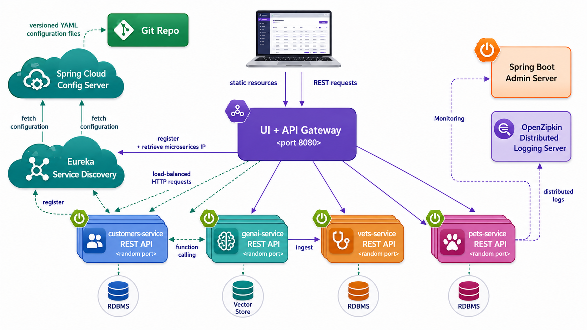
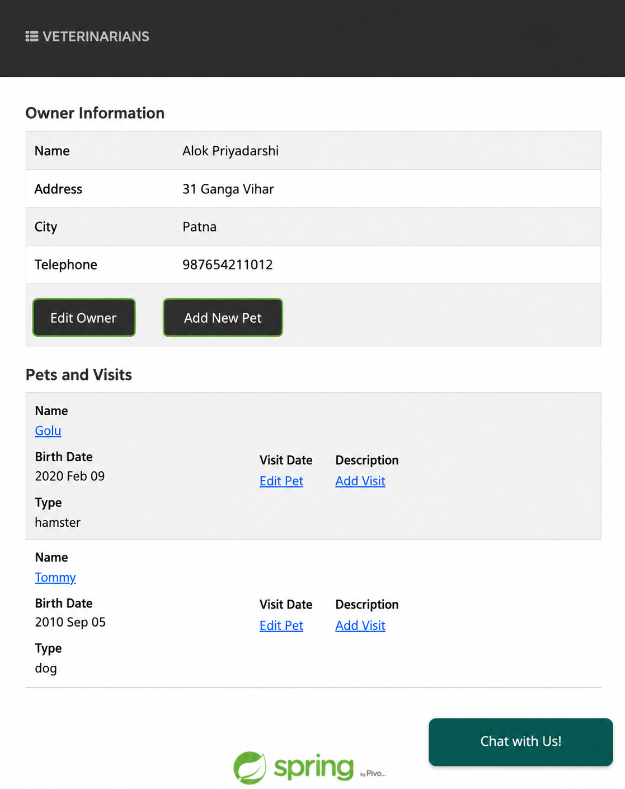
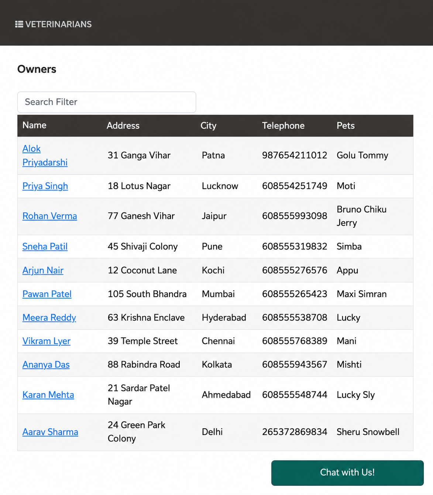
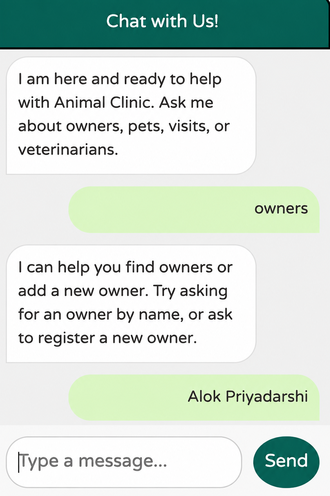
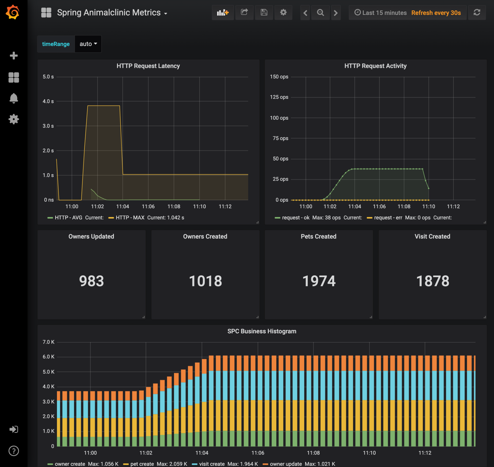

# Animal Clinic Microservices

Animal Clinic is a distributed Spring Boot sample application built with Spring Cloud, AngularJS, Micrometer, Prometheus, Grafana, Eureka Service Discovery, and Spring AI.

The application demonstrates a small veterinary clinic system split into independent services. The frontend is served by the API Gateway, and backend services manage owners, pets, veterinarians, visits, chatbot replies, configuration, discovery, and monitoring.

## Preview












## Features

- AngularJS frontend served through Spring Cloud Gateway.
- Owner, pet, veterinarian, and visit management.
- GenAI chatbot for Animal Clinic questions.
- Eureka service discovery.
- Centralized configuration with Spring Cloud Config.
- Prometheus metrics and Grafana dashboards.
- Spring Boot Admin support.
- Optional MySQL profile for persistent storage.

## Tech Stack

| Category | Technology |
| --- | --- |
| Programming Language | Java 21 |
| Backend Framework | Spring Boot 4 |
| Microservices | Spring Cloud |
| API Gateway | Spring Cloud Gateway / WebFlux |
| Service Discovery | Netflix Eureka |
| Configuration | Spring Cloud Config Server |
| AI Integration | Spring AI, OpenAI API |
| Frontend | AngularJS, Bootstrap, Font Awesome |
| Database | HSQLDB, MySQL |
| ORM / Persistence | Spring Data JPA |
| Monitoring | Micrometer, Prometheus, Grafana |
| Tracing | Zipkin |
| Resilience | Resilience4j Circuit Breaker |
| Caching | Caffeine |
| Build Tool | Maven / Maven Wrapper |
| Containerization | Docker, Docker Compose |
| Testing | JUnit 5, Spring Boot Test |
| Deployment Config | Docker Compose, Kubernetes, Vercel |

## Project Structure

```text
MicroserviceX/
├── .devcontainer/
├── .github/
├── .mvn/
│   └── wrapper/
├── api/
│   └── genai/
├── docker/
│   ├── grafana/
│   │   └── dashboards/
│   └── prometheus/
├── images/
│   ├── golden_retriever_cat.png
│   ├── preview-1.png
│   ├── preview-2.png
│   ├── preview-3.png
│   ├── preview-4.png
│   ├── preview-5.png
│   └── preview-6.png
├── k8s/
│   ├── configmaps.yaml
│   ├── deployments.yaml
│   ├── kustomization.yaml
│   ├── namespace.yaml
│   └── services.yaml
├── scripts/
├── spring-animalclinic-admin-server/
│   ├── pom.xml
│   └── src/
├── spring-animalclinic-api-gateway/
│   ├── pom.xml
│   └── src/
│       └── main/
│           └── resources/
│               └── static/
├── spring-animalclinic-config-server/
│   ├── pom.xml
│   └── src/
├── spring-animalclinic-customers-service/
│   ├── pom.xml
│   └── src/
├── spring-animalclinic-discovery-server/
│   ├── pom.xml
│   └── src/
├── spring-animalclinic-genai-service/
│   ├── pom.xml
│   └── src/
├── spring-animalclinic-vets-service/
│   ├── pom.xml
│   └── src/
├── spring-animalclinic-visits-service/
│   ├── pom.xml
│   └── src/
├── .editorconfig
├── .gitattributes
├── .gitignore
├── docker-compose.yml
├── LICENSE
├── mvnw
├── mvnw.cmd
├── package.json
├── pom.xml
├── README.md
└── vercel.json
```

## Services

| Service | Purpose | Local URL |
| --- | --- | --- |
| API Gateway | Frontend and route gateway | http://localhost:8080 |
| Discovery Server | Eureka registry | http://localhost:8761 |
| Config Server | Central configuration | http://localhost:8888 |
| Admin Server | Spring Boot Admin | http://localhost:9090 |
| GenAI Service | Chatbot backend | http://localhost:8084 |
| Prometheus | Metrics database | http://localhost:9091 |
| Grafana | Metrics dashboards | http://localhost:3030 |

Customers, vets, and visits services register with Eureka and can run on dynamic ports.

## Run Locally

Start the support services first:

```bash
./mvnw -pl spring-animalclinic-config-server spring-boot:run
./mvnw -pl spring-animalclinic-discovery-server spring-boot:run
```

Then start the application services:

```bash
./mvnw -pl spring-animalclinic-customers-service spring-boot:run
./mvnw -pl spring-animalclinic-vets-service spring-boot:run
./mvnw -pl spring-animalclinic-visits-service spring-boot:run
./mvnw -pl spring-animalclinic-genai-service spring-boot:run -Dspring-boot.run.arguments=--server.port=8084
./mvnw -pl spring-animalclinic-api-gateway spring-boot:run
```

Open the app at:

```text
http://localhost:8080
```

## Run With Docker Compose

Build the container images:

```bash
./mvnw clean install -P buildDocker
```

Start the stack:

```bash
docker compose up
```

Start only Grafana and Prometheus:

```bash
docker compose up -d grafana-server prometheus-server
```

Docker Desktop or another Docker compatible runtime must be installed and running.

## Run With Kubernetes

Validate the manifests locally:

```bash
scripts/check_k8s.sh
```

Deploy the stack into the `animalclinic` namespace:

```bash
kubectl apply -k k8s
kubectl -n animalclinic get pods
```

Access the API Gateway locally:

```bash
kubectl -n animalclinic port-forward svc/api-gateway 8080:8080
```

Open the app at:

```text
http://localhost:8080
```

See `k8s/README.md` for monitoring port forwards, optional GenAI secrets, and cleanup steps.

## Chatbot

The GenAI service is the backend for the “Chat with Us!” widget. It can use OpenAI when a real key is configured:

```bash
export OPENAI_API_KEY="your_api_key_here"
```

The app also includes a local fallback response path for development, so the chatbot can still answer basic Animal Clinic questions when no real API key is available.

Example questions:

1. List the owners.
2. Which owners have pets?
3. Show veterinarians.
4. Help me add a new owner.
5. Tell me about visits.

## Monitoring

Prometheus and Grafana are included for application metrics.

- Prometheus: http://localhost:9091
- Grafana: http://localhost:3030
- Dashboard: http://localhost:3030/d/69JXeR0iw/spring-animalclinic-metrics

The dashboard configuration lives in:

```text
docker/grafana/dashboards/grafana-animalclinic-dashboard.json
```

## Database

By default, Animal Clinic uses an in memory HSQLDB database populated at startup.

To run with MySQL, start a database:

```bash
docker run -e MYSQL_ROOT_PASSWORD=animalclinic -e MYSQL_DATABASE=animalclinic -p 3306:3306 mysql:8.4.5
```

Then start the data services with the MySQL Spring profile:

```bash
--spring.profiles.active=mysql
```

The MySQL schema and data scripts are available under each data service’s `db/mysql` directory.

## Useful Project Paths

| Area | Path |
| --- | --- |
| Gateway frontend | `spring-animalclinic-api-gateway/src/main/resources/static` |
| Gateway routes | `spring-animalclinic-api-gateway/src/main/resources/application.yml` |
| Customers service | `spring-animalclinic-customers-service` |
| Vets service | `spring-animalclinic-vets-service` |
| Visits service | `spring-animalclinic-visits-service` |
| GenAI service | `spring-animalclinic-genai-service` |
| Kubernetes manifests | `k8s` |
| Grafana dashboard | `docker/grafana/dashboards/grafana-animalclinic-dashboard.json` |
| Prometheus config | `docker/prometheus/prometheus.yml` |
| Preview images | `images` |

## Build

Build all modules:

```bash
./mvnw clean package
```

Build one module:

```bash
./mvnw -pl spring-animalclinic-api-gateway clean package
```

Skip tests during local packaging:

```bash
./mvnw clean package -DskipTests
```

## CSS

The compiled stylesheet is:

```text
spring-animalclinic-api-gateway/src/main/resources/static/css/animalclinic.css
```

The source stylesheet is:

```text
spring-animalclinic-api-gateway/src/main/resources/static/scss/animalclinic.scss
```

Rebuild CSS with:

```bash
cd spring-animalclinic-api-gateway
../mvnw generate-resources -Pcss
```
